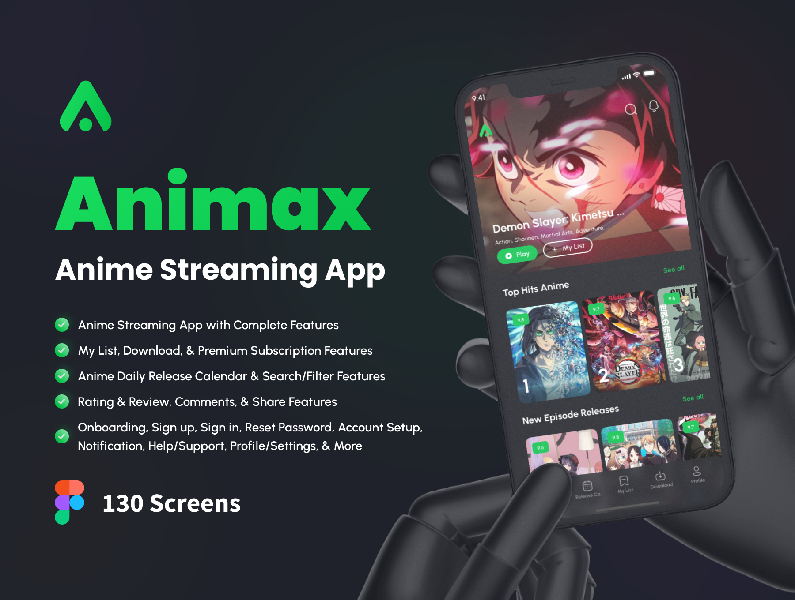

<p align="center" >
  <a href="https://www.npmjs.com/~nestjscore" target="_blank">
  
  </a>
  <a href="https://www.npmjs.com/~nestjscore" target="_blank">
  
  </a>
</p>

<br/> 

# Guide
## Installation FrontEnd

```bash
# transition to FrontEnd
$ cd '.\FrontEnd\'

# install
$ npm install
```
## env the app

```bash

# Main Api  
$ EXPO_PUBLIC_API_URL

# Anime Api
$ EXPO_PUBLIC_ANIME_API_GRAPHQL

```

## Running the app

```bash

# start  
$ npx expo start

# start android
$ npm expo android

# start ios
$ npm expo ios

# start development
$ npm expo start:dev
```
